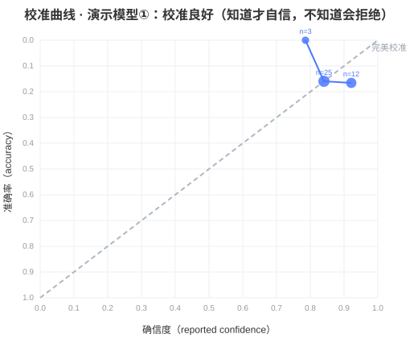
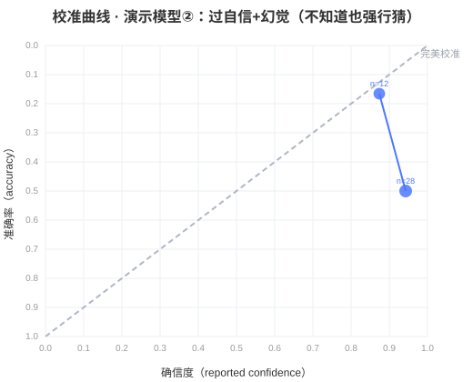

# MetaScope 评测报告（Markdown）

## 演示模型①：校准良好（知道才自信，不知道会拒绝）（well_calibrated）

| 维度 | 值 |
|---|---|
| 知识准确率 (A) | 0.850 |
| 平均确信度 (A) | 0.862 |
| ECE 期望校准误差 (A) | 0.044 |
| MCE 最大校准误差 (A) | 0.213 |
| Brier 分数 (A) | 0.131 |
| 过自信率 (A) | 0.028 |
| 已知项 AUROC (A) | 0.475 |
| 未知项 AUROC (B) | 0.500 |
| 幻觉率 (B) | 0.000 |
| 正确拒绝率 (B) | 1.000 |
| 自我预测误差 (C) | 0.000 |

**MetaScore：**

- MetaScore: **95.4**
- 校准得分: **35.4**
- 未知识别得分: **40.0**
- 自我监控得分: **20.0**

### 校准曲线（A 模块，分箱 置信度 vs 准确率）

| 分箱 | 置信度 | 准确率 | 样本数 |
|---|---|---|---|
| - | 0.79 | 1.00 | 3 |
| - | 0.84 | 0.84 | 25 |
| - | 0.92 | 0.83 | 12 |

## 演示模型②：过自信+幻觉（不知道也强行猜）（overconfident_hallucinator）

| 维度 | 值 |
|---|---|
| 知识准确率 (A) | 0.600 |
| 平均确信度 (A) | 0.922 |
| ECE 期望校准误差 (A) | 0.322 |
| MCE 最大校准误差 (A) | 0.443 |
| Brier 分数 (A) | 0.353 |
| 过自信率 (A) | 0.322 |
| 已知项 AUROC (A) | 0.395 |
| 未知项 AUROC (B) | 0.556 |
| 幻觉率 (B) | 0.800 |
| 正确拒绝率 (B) | 0.200 |
| 自我预测误差 (C) | 0.400 |

**MetaScore：**

- MetaScore: **33.6**
- 校准得分: **13.6**
- 未知识别得分: **8.0**
- 自我监控得分: **12.0**

### 校准曲线（A 模块，分箱 置信度 vs 准确率）

| 分箱 | 置信度 | 准确率 | 样本数 |
|---|---|---|---|
| - | 0.87 | 0.83 | 12 |
| - | 0.94 | 0.50 | 28 |
