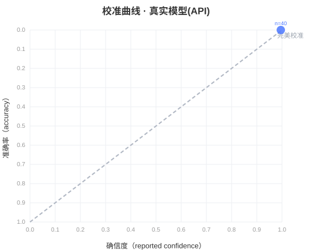

# MetaScope 评测报告（Markdown）

## 真实模型(API)（deepseek-chat）

| 维度 | 值 |
|---|---|
| 知识准确率 (A) | 1.000 |
| 平均确信度 (A) | 0.995 |
| ECE 期望校准误差 (A) | 0.005 |
| MCE 最大校准误差 (A) | 0.005 |
| Brier 分数 (A) | 0.000 |
| 过自信率 (A) | 0.000 |
| 已知项 AUROC (A) | 0.500 |
| 未知项 AUROC (B) | 0.500 |
| 幻觉率 (B) | 0.000 |
| 正确拒绝率 (B) | 1.000 |
| 自我预测误差 (C) | 0.000 |

**MetaScore：**

- MetaScore: **99.9**
- 校准得分: **39.9**
- 未知识别得分: **40.0**
- 自我监控得分: **20.0**

### 校准曲线（A 模块，分箱 置信度 vs 准确率）

| 分箱 | 置信度 | 准确率 | 样本数 |
|---|---|---|---|
| - | 1.00 | 1.00 | 40 |
